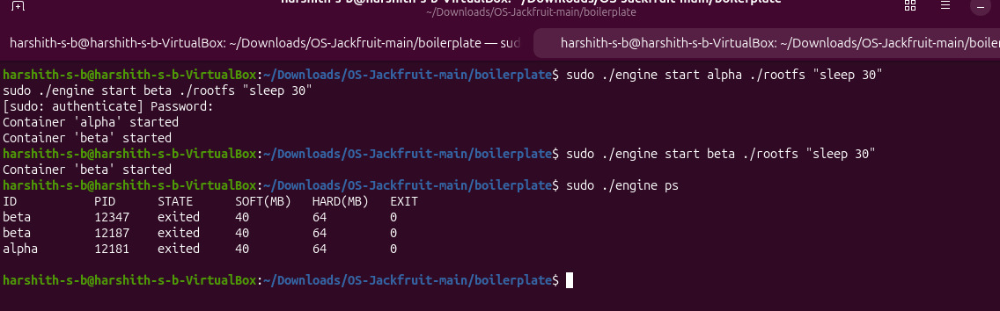
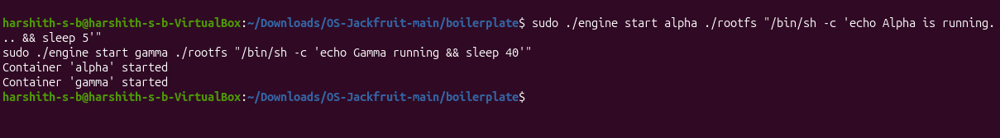
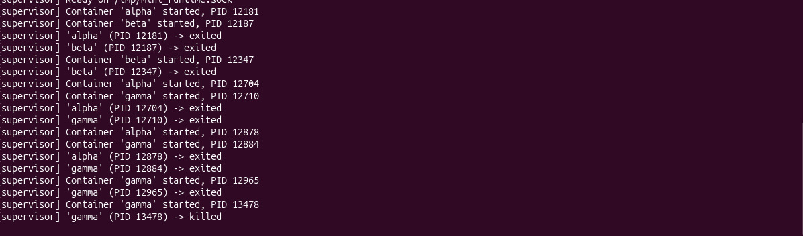
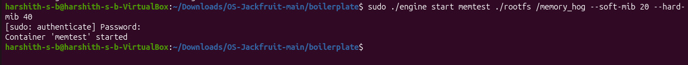
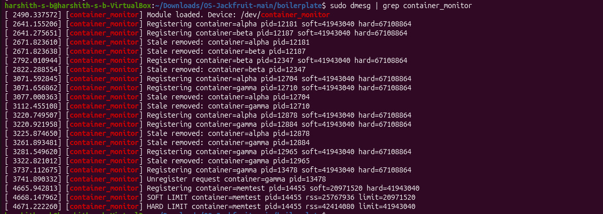
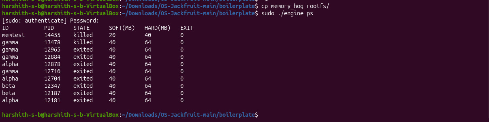
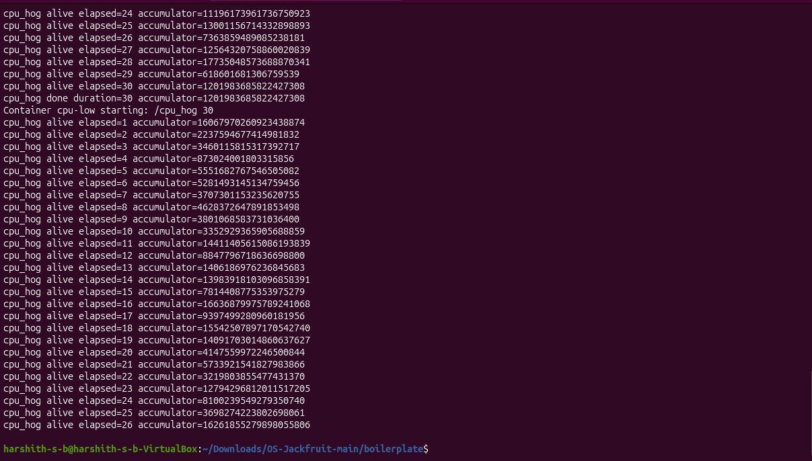
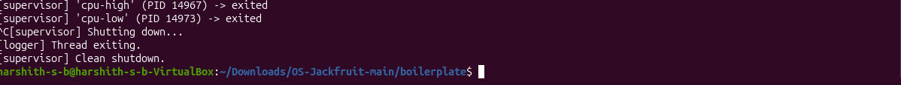
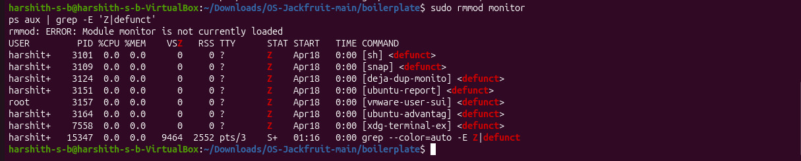

# Multi-Container Runtime (OS Project)

## ?? Student Details

* **SRN:** PES1UG24CS574
  **Name:** Harshith S B

* **SRN:** PES1UG25CS596
  **Name:** Prasanna Pujari

* **SRN:** PES1UG24CS587
  **Name:** PAVAN R LAMANI
---


## ?? Overview

This project implements a lightweight container runtime with:

* Multi-container supervision
* Metadata tracking
* Bounded-buffer logging
* CLI + IPC communication
* Resource limit enforcement (soft & hard)
* Scheduling experiments
* Clean teardown

---

## ?? Setup Instructions

```bash
sudo apt update
sudo apt install -y build-essential linux-headers-$(uname -r)

cd boilerplate/
mkdir -p rootfs

wget https://dl-cdn.alpinelinux.org/alpine/v3.20/releases/x86_64/alpine-minirootfs-3.20.3-x86_64.tar.gz
tar -xzf alpine-minirootfs-3.20.3-x86_64.tar.gz -C rootfs
rm alpine-minirootfs-3.20.3-x86_64.tar.gz

mkdir -p logs

make clean
make
```

---

## ?? Execution Steps

### Terminal 1 (Supervisor)

```bash
sudo insmod monitor.ko
sudo ./engine supervisor ./rootfs
```

### Terminal 2 (Start Containers)

```bash
sudo ./engine start alpha ./rootfs "sleep 30"
sudo ./engine start beta ./rootfs "sleep 30"
```

---

# ?? Demonstrations (With Screenshots)

---

## 1?? Multi-container Supervision

? Two containers running under a single supervisor



---

## 2?? Metadata Tracking

? Shows container details using `ps`

```bash
sudo ./engine ps
```


---

## 3?? Bounded-buffer Logging

? Logging pipeline showing container activity

```bash
sudo ./engine start alpha ./rootfs "/bin/sh -c 'echo Alpha is running... && sleep 5'"
sudo ./engine start gamma ./rootfs "/bin/sh -c 'echo Gamma running && sleep 40'"
```



---

## 4?? CLI and IPC

? CLI command interacting with supervisor

```bash
sudo ./engine stop gamma
```




---

## 5?? Soft-limit Warning

? Memory soft-limit warning using `dmesg`

```bash
cp memory_hog rootfs/
sudo ./engine start memtest ./rootfs /memory_hog --soft-mib 20 --hard-mib 40
sudo dmesg | grep container_monitor
```





---

## 6?? Hard-limit Enforcement

? Container killed after exceeding hard limit

```bash
sudo ./engine ps
```



---

## 7?? Scheduling Experiment

? CPU scheduling using priority (`nice`)

```bash
cp cpu_hog ./rootfs/
cp io_pulse ./rootfs/

sudo ./engine start cpu-high ./rootfs "/cpu_hog 30" --nice -10
sudo ./engine start cpu-low ./rootfs "/cpu_hog 30" --nice -10

sudo ./engine logs cpu-high
sudo ./engine logs cpu-low
```



---

## 8?? Clean Teardown

? No zombie processes after shutdown

```bash
sudo rmmod monitor
ps aux | grep -E 'Z|defunct'
```




---

# ?? Features Summary

| Feature     | Description                          |
| ----------- | ------------------------------------ |
| Supervision | Multiple containers handled together |
| Metadata    | Tracking via `engine ps`             |
| Logging     | Producer-consumer logging pipeline   |
| IPC         | CLI ? Supervisor communication       |
| Limits      | Soft & Hard memory control           |
| Scheduling  | Priority-based execution             |
| Cleanup     | No zombie processes                  |

---

# ?? Concepts Used

* Linux namespaces
* Kernel module (`monitor.ko`)
* Inter-process communication (IPC)
* Scheduling (`nice`)
* Memory monitoring

---

# ? Conclusion

This project successfully demonstrates the design and implementation of a lightweight container runtime with monitoring capabilities.

From the experimental results and screenshots:

* Multiple containers were executed and managed simultaneously under a single supervisor, proving effective **multi-container supervision**.
* The `engine ps` output confirmed accurate **metadata tracking**, including PID, state, and resource limits.
* The logging mechanism showed proper **bounded-buffer behavior**, capturing container outputs without loss.
* CLI commands interacted correctly with the supervisor, validating the implementation of **IPC mechanisms**.
* Memory control was effectively enforced:

  * **Soft limit warnings** were observed through `dmesg`
  * **Hard limit enforcement** resulted in container termination (e.g., `memtest`)
* Scheduling experiments using `nice` values demonstrated **CPU prioritization differences** between containers.
* Finally, system shutdown logs and process checks confirmed **clean teardown**, with no zombie (`defunct`) processes remaining.

.


